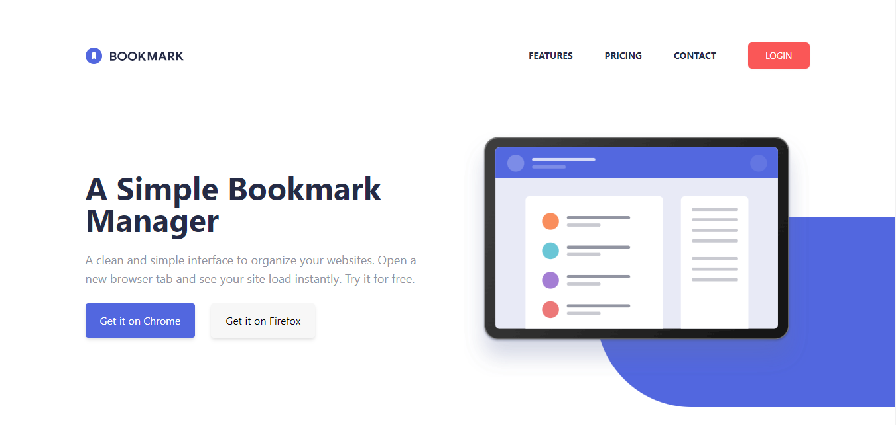

# Frontend Mentor - Bookmark landing page solution

This is a solution to the [Bookmark landing page challenge on Frontend Mentor](https://www.frontendmentor.io/challenges/bookmark-landing-page-5d0b588a9edda32581d29158). Frontend Mentor challenges help you improve your coding skills by building realistic projects.

## Welcome! 👋

> Thanks for checking this project out. This is my first time of using tailwind css and I can say that it's pretty amazing!

## Live Demo

- Live Site URL: [live site](https://insure-lainding-page-react.netlify.app/);

;

## Overview

This is a frontend coding challenge to help you improve your coding skills... This is an interesting and challenging project I might add, working with tailwind css to design this beautiful landing page, which has a lot of features, without further ado, let's get started

### The challenge

Users should be able to:

- View the optimal layout for the site depending on their device's screen size
- See hover states for all interactive elements on the page
- Receive an error message when the newsletter form is submitted if:

  - The input field is empty
  - The email address is not formatted correctly

  ### Screenshot

;

;

### Links

- Solution URL: [solution](https://www.frontendmentor.io/solutions/responsive-landing-page-using-react-and-sass-jufyodvWQ)
- Live Site URL: [live site](https://insure-lainding-page-react.netlify.app/);

## My process

**this project was created with "create-react-app"** from React: a frontend library for creating beautiful and interactive web applications.

> Installed Tailwind css with npm and configured tailwind css for create-react-app following the guideline provided by the official documentation.

> The goal is to create an optimal view and user friendly interface, usability and accessiblity for both desktop and mobile.

### Built with

- Semantic HTML5 markup
- Tailwind css Flexbox
- Tailwind CSS Grid
- Mobile-first workflow
- [React](https://reactjs.org/) - JS library
- [TailwindCss](https://tailwindcss.org/) - Taliwind CSS

## Author

- Website - [My Portfolio](https://ebukaeze.netlify.app)
- Frontend Mentor - [@kingbaddo](https://www.frontendmentor.io/profile/kingbaddo)
- Twitter - [@vikkzero](https://www.twitter.com/vikkzero)

Runs the app in the development mode.\
Open [http://localhost:3000](http://localhost:3000) to view it in the browser.

The page will reload if you make edits.\
You will also see any lint errors in the console.

### `npm run build`

Builds the app for production to the `build` folder.\
It correctly bundles React in production mode and optimizes the build for the best performance.

The build is minified and the filenames include the hashes.\
Your app is ready to be deployed!

See the section about [deployment](https://facebook.github.io/create-react-app/docs/deployment) for more information.
